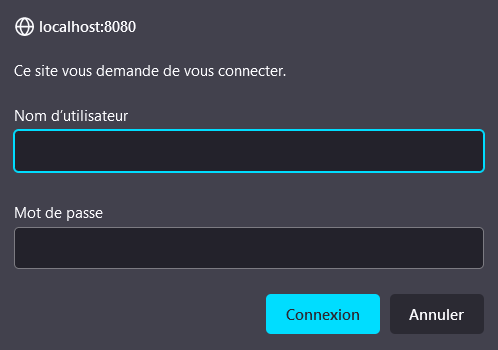
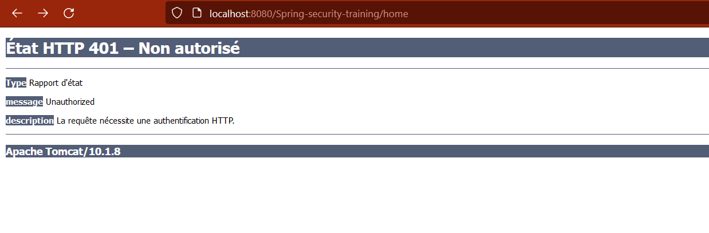
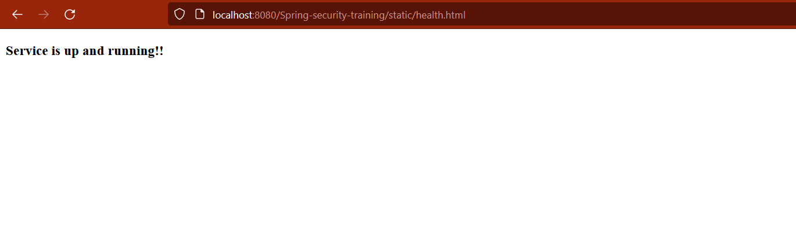
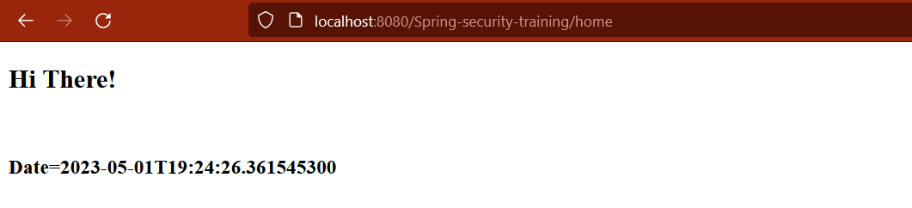

# spring-security-6-example

## Purpose of this repository

This repository was created for education purposes. The goal is to show the skeleton of a basic application using Java, Spring MVC 6, Spring Security 6. Importantly, this project does NOT use Spring Boot.

I've created this repository because the internet currently doesn't offer any tutorial using Spring Security 6 without Spring Boot. Many tutorial are available with Spring Security 5 or Spring Boot 6 though.

## Repository content

This project contains :

* ``/health.html``, a page accessible without any permission ;
* ``/home``, a JSP file requiring to authenticate with HttpBasic for access ;
* A UserDetailsService called ``AppUserDetailsServiceDAO`` to provide Spring Security with the credentials of a single hard-coded user when necessary. *Username: pankaj ; Password: pankaj123.* This user has role "ADMIN". In a real application, ``AppUserDetailsServiceDAO`` should be an actual DAO and call the database to retrieve users credentials.
* Plenty of necessary Spring Security config beans in ``WebConfig.java``, alongside Spring MVC config beans.
* One ``System.out.println`` in almost every method so you can see which ones are called if you run the project on your own machine. However, the trace is also availabel below.

## Sources

This repository was created by myself, a beginner, out of multiple sources:

* A tutorial on DigitalOcean to [implement a basic Spring Security 5 web application](https://www.digitalocean.com/community/tutorials/spring-security-example-tutorial) with base Javax ;
* A tutorial on Baeldung to [implement a basic Spring MVC application](https://www.baeldung.com/spring-mvc-tutorial), still in Spring 5 ;
* A tutorial on Baeldung to [upgrade an application to Spring Security 6](https://www.baeldung.com/spring-deprecated-websecurityconfigureradapter) ;
* Various articles and answers given on StackOverflow to complete the mentioned tutorials.

## Output

In case you don't wish to download and run this project, I've done it on my Tomcat 10 for you!

### Actions by browser user

1. Server starts
2. Unknown user tries accessing ``/home`` page but closes the login prompt. They are redirected to 401 error page. Nothing is logged.


3. User tries accessing ``/static/health.html`` page. No credentials are required. The page appears and nothing is logged.

4. User tries accessing ``/home`` page but inputs wrong credentials. The credentials prompt simply reopens in the browser.
5. User tries accessing ``/home`` page, with correct credentials this time.

6. User updates the ``/home`` page. Spring Security checks the user credentials again even though the user doesn't have to explicitly provide them again.


### Log

Note: In this log, most lines come from ``System.out.println`` calls in the code from this repository. In contrast, comments using the ``/* comment */`` syntax were not in the original log.

```log
[...]
/* Step 1: Server finishes starting */
01-May-2023 18:57:25.032 INFO [main] org.apache.coyote.AbstractProtocol.start Starting ProtocolHandler ["http-nio-8080"]
01-May-2023 18:57:25.053 INFO [main] org.apache.catalina.startup.Catalina.start Server startup in [6720] milliseconds
http://localhost:8080/Spring-security-training
/* Step 2: Unknown user tries accessing "/home" page but closes the login prompt. They are redirected to 401 error page. Nothing is logged. */
/* Step 3: User tries accessing "/static/health.html" page. No credentials are required. The page appears and nothing is logged. */
/* Step 4: User tries accessing "/home" page but inputs wrong credentials. The credentials prompt simply reopens in the browser. */
AppUserDetailsServiceDAO - loadUserByUsername
Purpose: Spring Security tries retrieving information about a user by calling custom DAO AppUserDetailsServiceDAO::loadUserByUsername, with username = Juanito
Username was not found by AppUserDetailsServiceDAO.
/* Step 5: User tries accessing "/home" page, with correct credentials this time. */
AppUserDetailsServiceDAO - loadUserByUsername
Purpose: Spring Security tries retrieving information about a user by calling custom DAO AppUserDetailsServiceDAO::loadUserByUsername, with username = pankaj
UserDetails - getPassword
Purpose: In the user details returned by AppUserDetailsServiceDAO, Spring Security asks for the password.
UserDetails - getAuthorities
Purpose: In the user details returned by AppUserDetailsServiceDAO, Spring Security asks for the roles granting permissions to this user.
HomeController - showHomepage
UserDetails - getUsername
Purpose: In the user details returned by AppUserDetailsServiceDAO, Spring Security asks for the username.
/* Step 6: User updates the "/home" page. Spring Security checks the user credentials again even though the user doesn't have to provide them again. */
AppUserDetailsServiceDAO - loadUserByUsername
Purpose: Spring Security tries retrieving information about a user by calling custom DAO AppUserDetailsServiceDAO::loadUserByUsername, with username = pankaj
UserDetails - getPassword
Purpose: In the user details returned by AppUserDetailsServiceDAO, Spring Security asks for the password.
UserDetails - getAuthorities
Purpose: In the user details returned by AppUserDetailsServiceDAO, Spring Security asks for the roles granting permissions to this user.
HomeController - showHomepage
UserDetails - getUsername
Purpose: In the user details returned by AppUserDetailsServiceDAO, Spring Security asks for the username.
```
